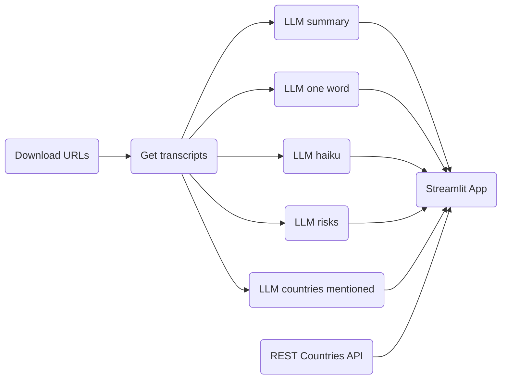
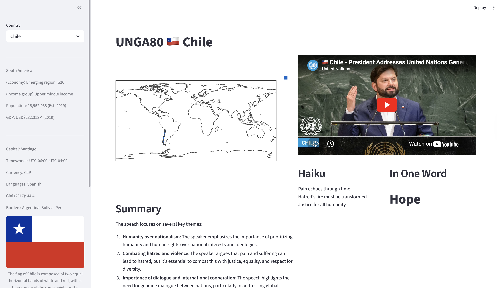

# UNGA80

# UN General Assermbly 80 Speeches

The app analyses the speech of each country at the #UNGA80 in September 2025.

- Summary of the speech.
- Summary in one word.
- Countries mentioned in the speech with positive and negative sentiment.
- Risks mentioned in the speech.
- Haiku generated with the speech.
- Information about the country.

The process is the following:





## LLM application

* [x] Summary of the speech
* [x] Summary in one word
* [x] List of countries mentioned and sentiment
* [x] Risks mentioned in the speech
* [ ] Emotion detection: speech, such as happiness, sadness, anger, or excitement
* [ ] **Inference Generation**: Use LLMs to generate inferences based on the speech content, such as predicting potential consequences of policy decisions oranticipating international reactions.
* [ ] Audio generation in Yoda's style

## Usage locally

### Prerequisits

```bash
curl -fsSL https://ollama.com/install.sh | sh
ollama pull llama3.2
ollama pull artifish/llama3.2-uncensored
```

### UNGA80 repository

```bash
# Clone this repository
git clone https://github.com/darenasc/unga80.git

# Change directory to repository
cd unga80

# Install dependencies
pip install pipenv
python3 -m pipenv install Pipfile
python3 -m pipenv install -d Pipfile

# Activate Python environment
pipenv shell

# Run the streamlit app
streamlit run app/app.py
```

## Tools used

- Ollama
- sqlite3
- `artifish/llama3.2-uncensored` model
- [plotly](https://docs.plotly.com)
- [REST Countries API](https://restcountries.com)

## Data
- [UNGA80 Speech urls](https://docs.google.com/spreadsheets/d/1qtqfnRSW24j-XLN7SRKywDCuFatARCH8pUg1Rr6I2vI/export?format=csv&gid=747748046)
- [Admin 0 – Countries](https://www.naturalearthdata.com/http//www.naturalearthdata.com/download/110m/cultural/ne_110m_admin_0_countries.zip)

## **Disclaimer**

This repository contains a project designed to analyze and process speeches from the United Nations using Large
Language Models (LLMs). The purpose of this project is for entertainment and educational purposes only.

**No Endorsement or Guarantee**

The analysis provided by this project should not be considered as an endorsement or guarantee of the accuracy,
completeness, or reliability of the information contained within. This project is intended to provide a general
overview of speech patterns and trends, but it may not capture the full complexity and nuance of the original
speeches.

**Limitations and Caveats**

* The analysis is based on pre-existing data and models, which may be biased towards certain perspectives or
interpretations.
* The LLMs used in this project are trained on vast amounts of text data, including texts that may contain errors,
inaccuracies, or outdated information.
* This project should not be used for decision-making or policy purposes, as the analysis may not provide a
comprehensive understanding of the complex issues involved.

**No Liability**

The repository author and maintainer make no warranties, express or implied, regarding the accuracy,
completeness, or reliability of the information contained within. By using this project, you acknowledge that you
are using it for personal, non-commercial purposes only.

**Attribution**

By using this project, you agree to hold harmless the repository author and maintainer from any claims or
liabilities arising from the use of this project.